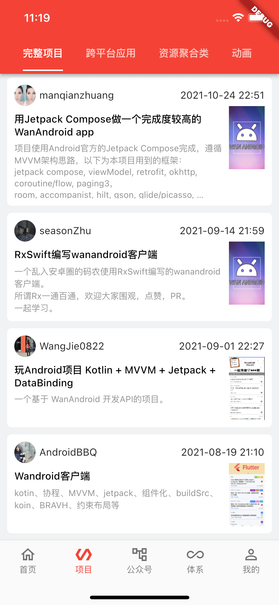
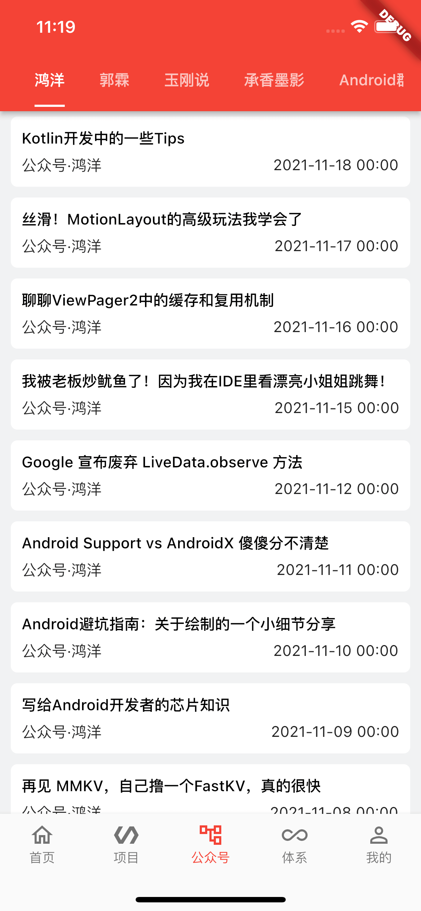
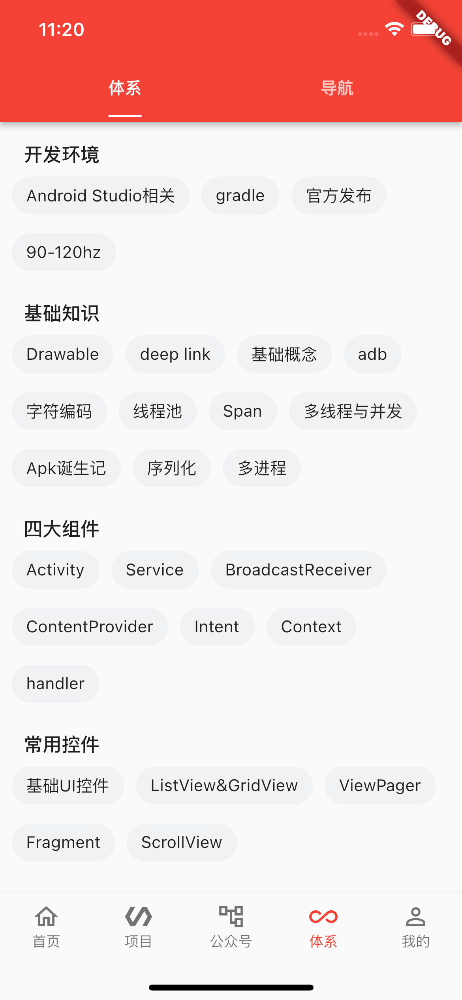

# wanandroid-flutter

[wanandroid.com](https://wanandroid.com) 网站的App版本，感谢该站点提供的免费API。

## 开发环境

- Android Studio 4.2.1
- Dart 2.14.4 (stable)
- Flutter 2.5.3 (stable)

以上是我当前的开发运行环境，仅供参考。

## 效果图

## TODO

还有太多功能待完善了，代码也并未做太多功能性封装，因为该项目仅是为了学习 Flutter 开发。
